# Diagramas do Sistema — Gestão Financeira Pessoal

Diagramas Mermaid e PlantUML descrevendo a arquitetura, modelos e fluxos do sistema.

---

## 1. Arquitetura em Camadas

### Mermaid

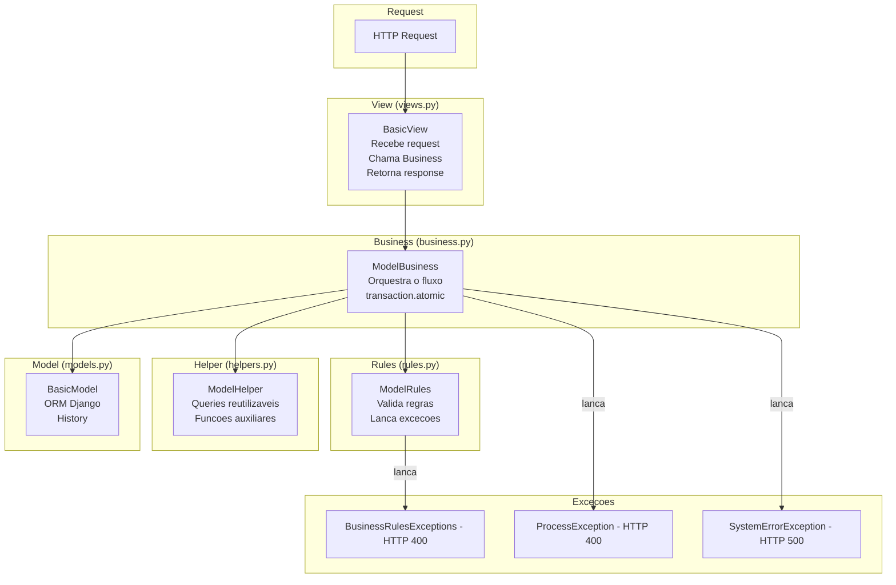

### PlantUML

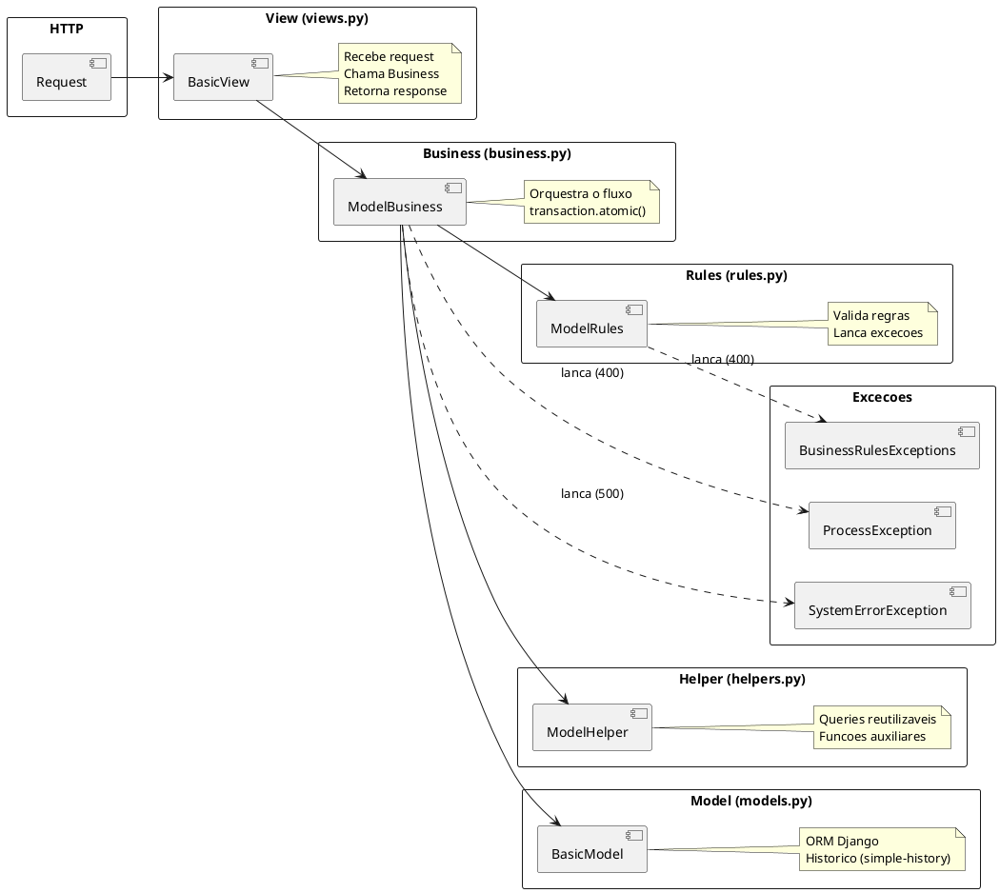

---

## 2. Diagrama de Classes — Models

### Mermaid

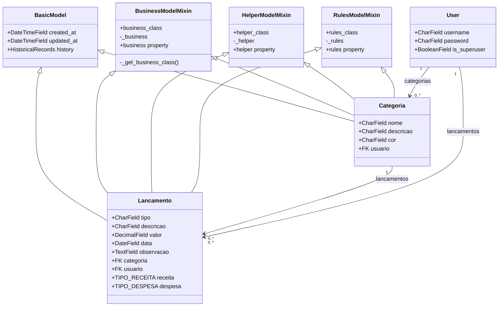

### PlantUML

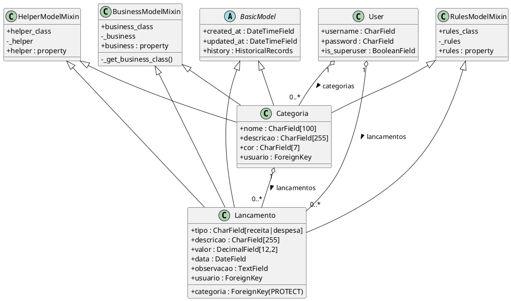

---

## 3. Diagrama de Sequência — Criar Lançamento

### Mermaid

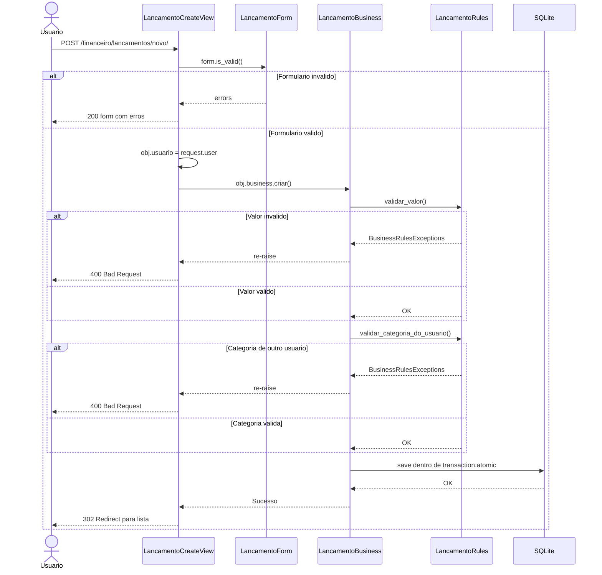

### PlantUML

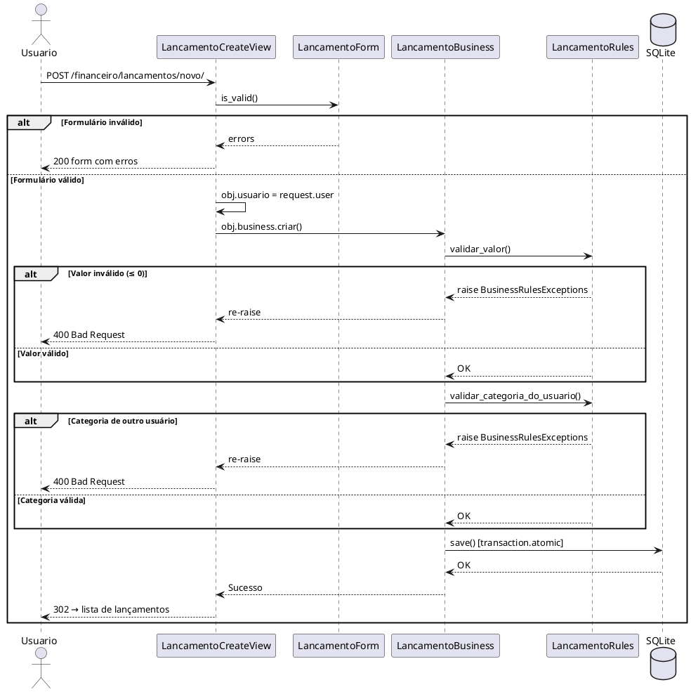

---

## 4. Fluxo de Autenticação

### Mermaid

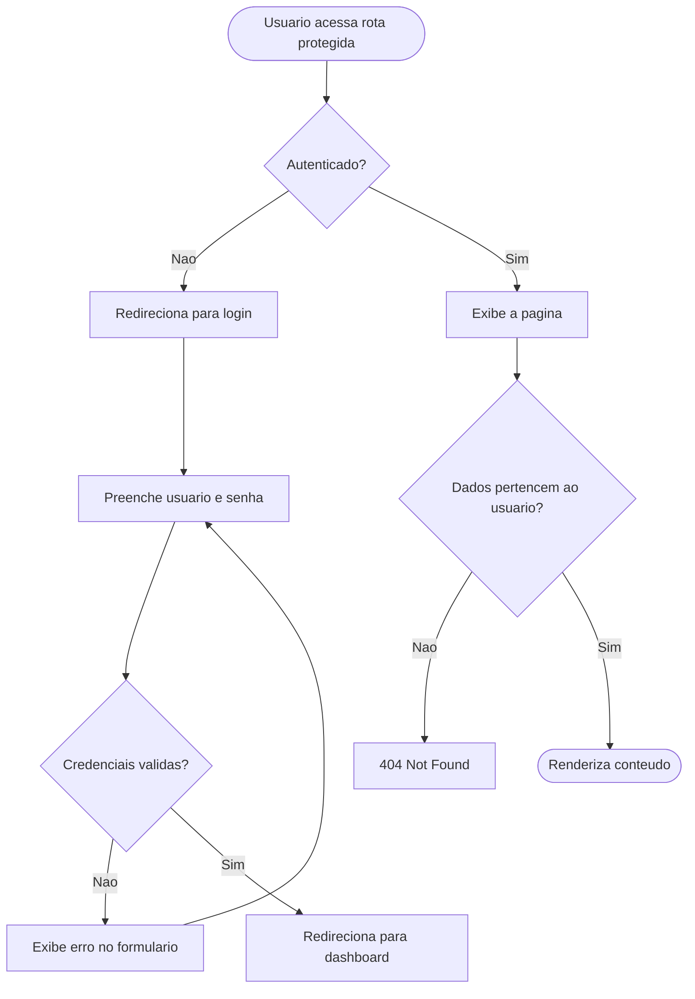

### PlantUML

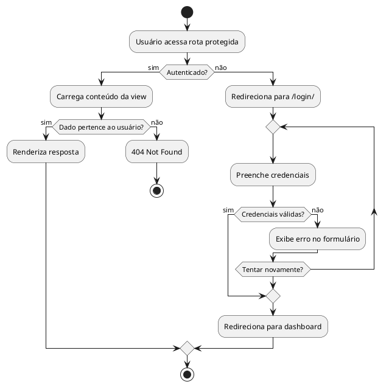

---

## 5. Estrutura de Rotas

### Mermaid

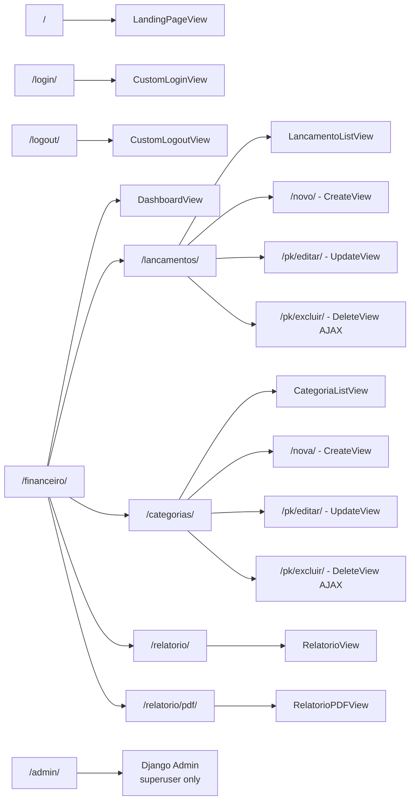

### PlantUML

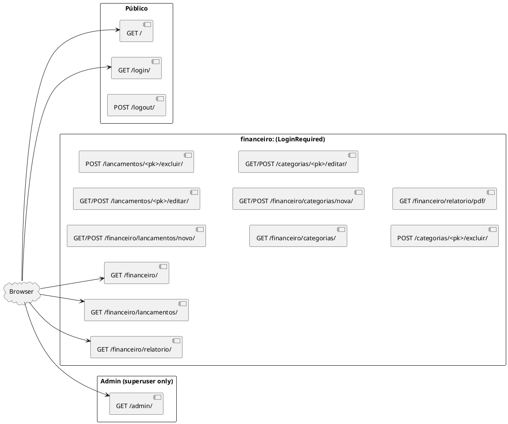

---

## 6. Diagrama de Estados — Lançamento

### Mermaid

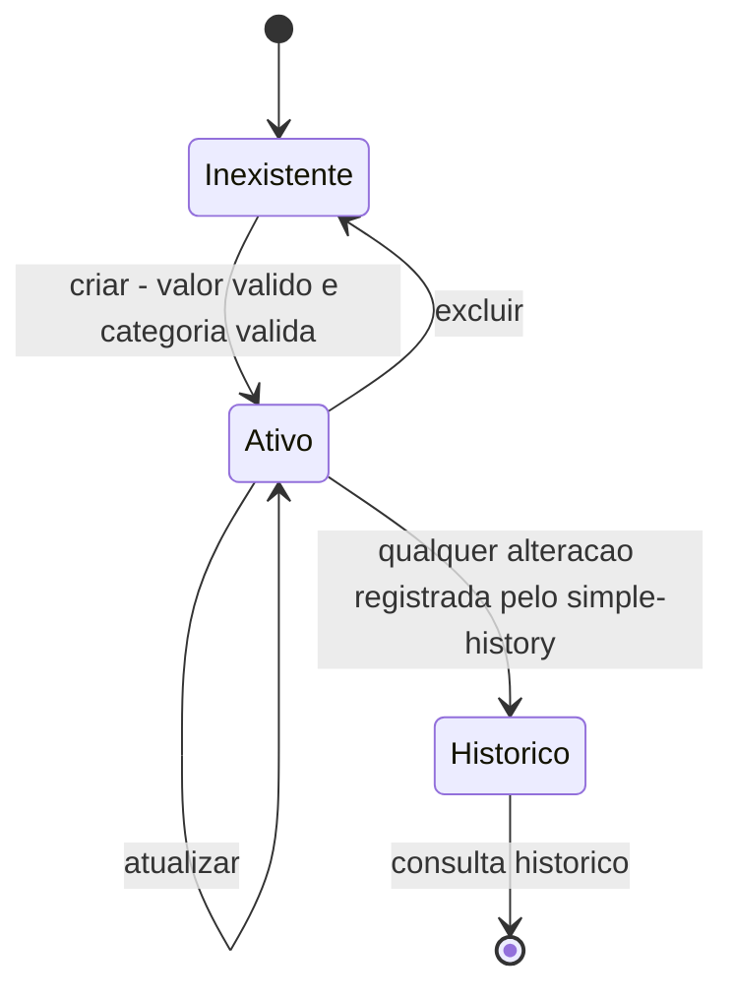

### PlantUML

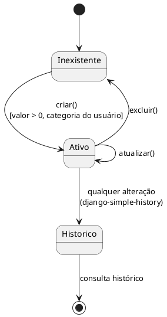
